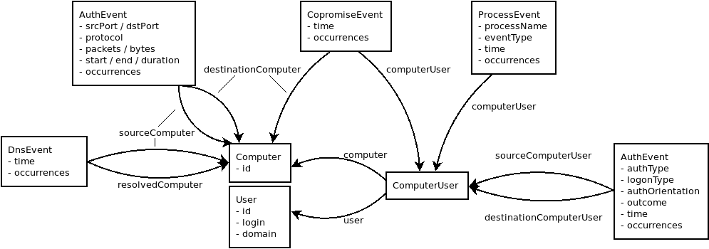

# Dataset pre-processing with Spark

This describes how [Apache Spark](https://spark.apache.org/) is used to transform
the ["Comprehensive, Multi-Source Cyber-Security Events"](https://csr.lanl.gov/data/cyber1/) dataset
into RDF files that can be loaded with [Dgraph Bulk Loader](https://dgraph.io/docs/deploy/fast-data-loading/#bulk-loader).

## The dataset

The dataset published by [Advanced Research in Cyber Systems](https://csr.lanl.gov/)
consists of five files:

|File            |Lines        |Size  |
|:--------------:|:-----------:|:----:|
|`auth.txt.gz`   |1,051,430,459|7.2 GB|
|`proc.txt.gz`   |  426,045,096|2.2 GB|
|`flow.txt.gz`   |  129,977,412|1.1 GB|
|`dns.txt.gz`    |   40,821,591|0.2 GB|
|`redteam.txt.gz`|          749|0.0 GB|


## Load the dataset

First we define the input schema with one `case class` per file:

```scala
case class Auth(time: Int, srcUser: String, dstUser: String, srcComputer: String, dstComputer: String, authType: Option[String], logonType: Option[String], authOrient: Option[String], outcome: Option[String])
case class Proc(time: Int, user: String, computer: String, processName: String, eventType: String)
case class Flow(time: Int, duration: Int, srcComputer: String, srcPort: Option[Int], dstComputer: String, dstPort: Option[Int], protocol: Option[String], packets: Option[Int], bytes: Option[Long])
case class Dns(time: Int, srcComputer: String, resolvedComputer: String)
case class Red(time: Int, user: String, srcComputer: String, dstComputer: String)
```

And we define a helper method to read any input file:

```scala
def read[T](path: String)(implicit spark: SparkSession, encoder: Encoder[T]): Dataset[T]
  spark
    .read
    .option("nullValue", "?")
    .schema(encoder.schema)
    .csv(path)
    .as[T](encoder)
```

Now we can load all dataset files:

```scala
val auth = read[Auth](s"$inputPath/auth.txt")
val proc = read[Proc](s"$inputPath/proc.txt")
val flow = read[Flow](s"$inputPath/flows.txt")
val dns = read[Dns](s"$inputPath/dns.txt")
val red = read[Red](s"$inputPath/redteam.txt")
```

Let's peek into those files:

```scala
scala> auth.show(5, false)
+------+-----------+-----------+-----------+-----------+--------+---------+----------+-------+
|time  |srcUser    |dstUser    |srcComputer|dstComputer|authType|logonType|authOrient|outcome|
+------+-----------+-----------+-----------+-----------+--------+---------+----------+-------+
|740822|C61$@DOM1  |C61$@DOM1  |C61        |C61        |null    |null     |TGS       |Success|
|740822|C61$@DOM1  |C61$@DOM1  |C61        |C61        |null    |Network  |LogOff    |Success|
|740822|C6121$@DOM1|C6121$@DOM1|C625       |C625       |null    |Network  |LogOff    |Success|
|740822|C6683$@DOM1|C6683$@DOM1|C6683      |C528       |Kerberos|Network  |LogOn     |Success|
|740822|C692$@DOM1 |C692$@DOM1 |C692       |C528       |Kerberos|Network  |LogOn     |Success|
+------+-----------+-----------+-----------+-----------+--------+---------+----------+-------+
only showing top 5 rows

scala> proc.show(5, false)
+------+----------+--------+-----------+---------+
|time  |user      |computer|processName|eventType|
+------+----------+--------+-----------+---------+
|641213|U307@DOM1 |C471    |P5         |End      |
|641213|U3174@DOM1|C8577   |P4         |Start    |
|641213|U3575@DOM1|C5030   |P12696     |Start    |
|641213|U3575@DOM1|C5030   |P12697     |End      |
|641213|U3575@DOM1|C5030   |P12697     |Start    |
+------+----------+--------+-----------+---------+
only showing top 5 rows

scala> flows.show(5, false)
+-------+--------+-----------+-------+-----------+-------+--------+-------+-----+
|time   |duration|srcComputer|srcPort|dstComputer|dstPort|protocol|packets|bytes|
+-------+--------+-----------+-------+-----------+-------+--------+-------+-----+
|1793739|10      |C21676     |null   |C1707      |null   |6       |6      |1241 |
|1793739|10      |C528       |445    |C15802     |null   |6       |15     |2418 |
|1793739|11      |C3238      |null   |C467       |445    |6       |17     |4295 |
|1793739|11      |C467       |445    |C3238      |null   |6       |14     |2152 |
|1793739|11      |C467       |445    |C3238      |null   |6       |15     |2418 |
+-------+--------+-----------+-------+-----------+-------+--------+-------+-----+
only showing top 5 rows

scala> dns.show(5, false)
+----+-----------+----------------+
|time|srcComputer|resolvedComputer|
+----+-----------+----------------+
|2   |C4653      |C5030           |
|2   |C5782      |C16712          |
|6   |C1191      |C419            |
|15  |C3380      |C22841          |
|18  |C2436      |C5030           |
+----+-----------+----------------+

scala> red.show(5, false)
+------+----------+-----------+-----------+
|time  |user      |srcComputer|dstComputer|
+------+----------+-----------+-----------+
|150885|U620@DOM1 |C17693     |C1003      |
|151036|U748@DOM1 |C17693     |C305       |
|151648|U748@DOM1 |C17693     |C728       |
|151993|U6115@DOM1|C17693     |C1173      |
|153792|U636@DOM1 |C17693     |C294       |
+------+----------+-----------+-----------+
only showing top 5 rows
```

## Write RDF

To come from both ends and connecting the strings in the middle, we define a method that writes our
`Triple`s as RDF files:

```scala
case class Triple(s: String, p: String, o: String)

def writeRdf(path: String, compressed: Boolean)(triples: Dataset[Triple]): Unit = {
  import triples.sqlContext.implicits._

  triples
    .select(concat($"s", lit(" "), $"p", lit(" "), $"o", lit(" .")))
    .write
    .mode(SaveMode.Overwrite)
    .when(compressed).call(_.option("compression", "gzip"))
    .text(path)
}
```

### Conditional and fluent transformation methods `when` and `call`

The `when` and `call` methods in this tutorial are helper methods that allow us to conditionally and fluently
call into methods that take a dataset as an argument. Without it

```scala
triples
  .write
  .when(compressed).call(_.option("compression", "gzip"))
  .text(path)
```

would read

```scala
val writer = triples.write
val writerWithOption =
  if (compressed) {
    writer.option("compression", "gzip")
  } else {
    writer
  }
writerWithOption.text(path)
```

Obviously, these helper methods make code much more readable.

It is available through the [spark-extension](https://github.com/G-Research/spark-extension#using-spark-extension)
dependency (≥1.3.0).

## Modelling the graph

Each input file has its corresponding entity (node type) in the schema depicted by boxes.
Users (`User`), computers (`Computer`) and users logged in to a particular computer (`ComputerUser`)
are modeled as specific entities, whereas in the input dataset they are mentioned in
the files but not explicitly defined.



## Transforming the dataset

### Users, computers and computer users

First we generate the users, computers and computer user instances by taking all users, computers
and user/computer co-occurrences that occur in the dataset. For instance, user ids can be found
in the `srcUser` and `dstUser` property of `auth`, as well as the `user` property of `proc` and `red`.

These entities have no `time` component, other than the entities that later represent the input files.

```scala
// Entities of the graph (have no time dimension)
case class User(blankId: Long, id: String, login: Option[String], domain: Option[String])
case class Computer(blankId: Long, id: String)
case class ComputerUser(blankId: Long, userId: Long, computerId: Long)

val users = Seq(
  auth.select(explode(array($"srcUser", $"dstUser")).as("id")),
  proc.select($"user".as("id")),
  red.select($"user".as("id")),
)
  .reduce(_.unionByName(_))
  .distinct()
  .call(addLoginAndDomain(_, $"id"))
  .call(addBlankId())
  .as[User]
  .cache()

…
```

User ids occur multiple times across those input files, and we are only want them once in out `user`
dataset, so we `distinct` them.

The `addLoginAndDomain` method splits the `id` on the `@` character and populates the `login` and `domain`
property.

With `addBlankId` we add a unique id to each line.

Finally, we cache `users`, `computers` and `computerUsers` because we reference these datasets multiple times
while they are very expensive to produce each time. These datasets are very small and easily fit into
memory.

The `users` dataset looks like:

```scala
scala> users.show(5, false)
+---------------------+---------------+------+-------+
|id                   |login          |domain|blankId|
+---------------------+---------------+------+-------+
|ANONYMOUS LOGON@C1065|ANONYMOUS LOGON|C1065 |1      |
|ANONYMOUS LOGON@C1529|ANONYMOUS LOGON|C1529 |2      |
|ANONYMOUS LOGON@C457 |ANONYMOUS LOGON|C457  |3      |
|ANONYMOUS LOGON@C586 |ANONYMOUS LOGON|C586  |4      |
|C1$@DOM1             |C1$            |DOM1  |5      |
+---------------------+---------------+------+-------+
only showing top 5 rows
```

We write user and computer entities as follows (here only users):

```scala
users
  .flatMap { user =>
    val userId = blank("user", user.blankId)
    Seq(
      Some(Triple(userId, predicate(isType), literal(Types.User))),
      Some(Triple(userId, predicate(id), literal(user.id, stringType))),
      user.login.map(v => Triple(userId, predicate(login), literal(v, stringType))),
      user.domain.map(v => Triple(userId, predicate(domain), literal(v, stringType))),
    ).flatten
  }
.call(writeRdf(s"$outputPath/users.rdf", compressRdf))
```

Using `case class User` and `flatMap` allows us to access the columns fully typed and compile-time checked
through the `user` variable. We define a `Seq` of `Triple`s, which we then write into the RDF file.

The RDF file looks like:
```text
_:user1 <dgraph.type> "User" .
_:user1 <id> "ANONYMOUS LOGON@C1065" .
_:user1 <login> "ANONYMOUS LOGON" .
_:user1 <domain> "C1065" .
```

From the users and computers that we have just written and cached, we define a mapping from the
`id` to the generated `blankId` as:

```scala
val userMapping = users.select($"id", $"blankId").as[(String, Long)].cache
val computerMapping = computers.select($"id", $"blankId").as[(String, Long)].cache

userMapping.show(5, false)
+---------------------+-------+
|id                   |blankId|
+---------------------+-------+
|ANONYMOUS LOGON@C1065|1      |
|ANONYMOUS LOGON@C1529|2      |
|ANONYMOUS LOGON@C457 |3      |
|ANONYMOUS LOGON@C586 |4      |
|C1$@DOM1             |5      |
+---------------------+-------+
only showing top 5 rows
```

These mappings can be cached in memory as well.

Computer users link to the `blankId` of users and computers, that we have just written to RDF files,
not the `id`s coming from the input files. So we have to apply our `userMapping` and `computerMapping`
before writing them to RDF as well:

```scala
computerUsers
  .call(mapIdToBlankId("user", "userId", userMapping))
  .call(mapIdToBlankId("computer", "computerId", computerMapping))
  …
```

With `mapIdToBlankId` we simply map the `userId` and `computerId` to the respective mappings' `blankId`:

```scala
def mapIdToBlankId[T](identifierColumnName: String, idColumnName: String, mapping: Dataset[(String, Long)])
                     (dataset: Dataset[T]): DataFrame = {
  dataset
    .join(
      broadcast(mapping.withColumnRenamed("blankId", idColumnName)),
      col(identifierColumnName) === col("id")
    )
    .drop(identifierColumnName, "id")
}
```

This turns

```scala
scala> computerUsers.show(5, false)
+---------------------+--------+-------+
|user                 |computer|blankId|
+---------------------+--------+-------+
|ANONYMOUS LOGON@C1065|C1065   |1      |
|ANONYMOUS LOGON@C1529|C1529   |2      |
|ANONYMOUS LOGON@C457 |C457    |3      |
|ANONYMOUS LOGON@C457 |C4615   |4      |
|ANONYMOUS LOGON@C586 |C1250   |5      |
+---------------------+--------+-------+
only showing top 5 rows
```

into

```scala
scala> computerUsers
  .call(mapIdToBlankId("user", "userId", userMapping))
  .call(mapIdToBlankId("computer", "computerId", computerMapping))
  .show(5, false)
+-------+------+----------+
|blankId|userId|computerId|
+-------+------+----------+
|1      |1     |70        |
|2      |2     |496       |
|3      |3     |1337      |
|4      |3     |1346      |
|5      |4     |245       |
+-------+------+----------+
only showing top 5 rows
```

After all mappings have been defined, we can remove the `users`, `computers` and `computerUsers`
tables from the cache:

```scala
users.unpersist()    // unpersist users dataset
computers.unpersist()    // unpersist computer dataset
computerUsers.unpersist()    // unpersist computer dataset
```

### Events and durations

All input files have a `time` component, so we model temporal graph-data next. First we define the
events and duration types:

```scala
// Event entities (events have time: Int)
case class AuthEvent(blankId: Long, srcComputerUserId: Long, dstComputerUserId: Long, authType: Option[String], logonType: Option[String], authOrient: Option[String], outcome: Option[String], time: Int, occurrences: Option[Int])
case class ProcessEvent(blankId: Long, computerUserId: Long, processName: String, eventType: String, time: Int, occurrences: Option[Int])
case class DnsEvent(blankId: Long, srcComputerId: Long, resolvedComputerId: Long, time: Int, occurrences: Option[Int])
case class CompromiseEvent(blankId: Long, computerUserId: Long, dstComputerId: Long, time: Int, occurrences: Option[Int])

// Duration entities (durations have Int start, end, duration)
case class FlowDuration(blankId: Long, srcComputerId: Long, dstComputerId: Long, srcPort: Option[Int], dstPort: Option[Int], protocol: Option[String], packets: Option[Int], bytes: Option[Long], start: Int, end: Int, duration: Int, occurrences: Option[Int])
```

Populating these types is a straight forward operation:

```scala
val authEvents =
  auth
    .call(mapUserAndComputerToBlankId("srcUser", "srcComputer", "srcComputerUserId", computerUserMapping))
    .call(mapUserAndComputerToBlankId("dstUser", "dstComputer", "dstComputerUserId", computerUserMapping))
    .when(deduplicateAuth).call(addOccurrences)
    .when(!deduplicateAuth).call(addNoOccurrences)
    .call(addId)
    .as[AuthEvent]

  …
```

We only need to map user and computer ids to the respective `blankId` using our mapping datasets.
Some input files need to be de-duplictated as some rows occur multiple times. These get the
`occurrences` property populated via `addOccurrences` with the respective number.

```scala
def addOccurrences[T](dataset: Dataset[T]): DataFrame = {
  import dataset.sqlContext.implicits._
  dataset
    .groupBy(dataset.columns.map(col): _*)
    .agg(count(lit(1)).cast(IntegerType).as("occurrences"))
    // only keep occurrences > 1
    .withColumn("occurrences", when($"occurrences" > 1, $"occurrences"))
}

def addNoOccurrences[T](dataset: Dataset[T]): DataFrame = {
  dataset.withColumn("occurrences", lit(null))
}
```

Similar to `addBlankId`, the `addId` operation adds unique ids to each row. The former only works
for small datasets that fit into a single partition, the latter works for arbitrary size datasets.

```scala
def addBlankId[T](order: Seq[String] = Seq("id"))(dataset: Dataset[T]): DataFrame =
  dataset.withColumn("blankId", row_number() over Window.partitionBy().orderBy(order.map(col): _*))

def addId[T](dataset: Dataset[T]): DataFrame =
  dataset.withColumn("blankId", monotonically_increasing_id())
```

This turns `auth`
```scala
scala> auth.show(5, false)
+----+--------------------+--------------------+-----------+-----------+---------+---------+----------+-------+
|time|srcUser             |dstUser             |srcComputer|dstComputer|authType |logonType|authOrient|outcome|
+----+--------------------+--------------------+-----------+-----------+---------+---------+----------+-------+
|1   |ANONYMOUS LOGON@C586|ANONYMOUS LOGON@C586|C1250      |C586       |NTLM     |Network  |LogOn     |Success|
|1   |ANONYMOUS LOGON@C586|ANONYMOUS LOGON@C586|C586       |C586       |null     |Network  |LogOff    |Success|
|1   |C101$@DOM1          |C101$@DOM1          |C988       |C988       |null     |Network  |LogOff    |Success|
|1   |C1020$@DOM1         |SYSTEM@C1020        |C1020      |C1020      |Negotiate|Service  |LogOn     |Success|
|1   |C1021$@DOM1         |C1021$@DOM1         |C1021      |C625       |Kerberos |Network  |LogOn     |Success|
+----+--------------------+--------------------+-----------+-----------+---------+---------+----------+-------+
only showing top 5 rows
```

into `authEvents`:
```scala
scala> authEvents.show(5, false)
+----+---------+---------+----------+-------+-----------------+-----------------+-----------+-------+
|time|authType |logonType|authOrient|outcome|srcComputerUserId|dstComputerUserId|occurrences|blankId|
+----+---------+---------+----------+-------+-----------------+-----------------+-----------+-------+
|1   |NTLM     |Network  |LogOn     |Success|5                |8                |null       |0      |
|1   |null     |Network  |LogOff    |Success|8                |8                |null       |1      |
|1   |null     |Network  |LogOff    |Success|19               |19               |null       |2      |
|1   |Negotiate|Service  |LogOn     |Success|26               |1107             |null       |3      |
|1   |Kerberos |Network  |LogOn     |Success|27               |28               |null       |4      |
+----+---------+---------+----------+-------+-----------------+-----------------+-----------+-------+
only showing top 5 rows
```

When all temporal instances are defined, we can write them to RDF as we did for the non-temporal
entities before:

```scala
authEvents
  .flatMap { event =>
    val eventId = blank("auth", event.blankId)
    Seq(
      Some(Triple(eventId, predicate(isType), literal(Types.AuthEvent))),
      Some(Triple(eventId, predicate(sourceComputerUser), blank("cu", event.srcComputerUserId))),
      Some(Triple(eventId, predicate(destinationComputerUser), blank("cu", event.dstComputerUserId))),
      event.authType.map(v => Triple(eventId, predicate(authType), literal(v, stringType))),
      event.logonType.map(v => Triple(eventId, predicate(logonType), literal(v, stringType))),
      event.authOrient.map(v => Triple(eventId, predicate(authOrient), literal(v, stringType))),
      event.outcome.map(v => Triple(eventId, predicate(outcome), literal(v, stringType))),
      Some(Triple(eventId, predicate(time), timeLiteral(event.time))),
      event.occurrences.map(v => Triple(eventId, predicate(occurrences), literal(v, integerType))),
    ).flatten
  }
  .call(writeRdf(s"$outputPath/auth-events.rdf", compressRdf))
```

Some triples are optional, as some properties like `authType` or `logonType` are.

Now we have transformed the dataset into RDF files than can be loaded by Dgraph.
For example, the `auth-events.rdf` file looks like

```text
_:auth0 <dgraph.type> "AuthEvent" .
_:auth0 <sourceComputerUser> _:cu5 .
_:auth0 <destinationComputerUser> _:cu8 .
_:auth0 <authType> "NTLM" .
_:auth0 <logonType> "Network" .
_:auth0 <authOrientation> "LogOn" .
_:auth0 <outcome> "Success" .
_:auth0 <time> "1" .
```

## Runtime statistics

This Spark application takes 2-3 hours with 8 CPUs, 4 GB JVM memory and 100 GB SSD
to transform the entire dataset into RDF.

Loading the RDF into Dgraph is a different story.
With 16 CPUs, 32 GB RAM, 200 GB temporary disk space and 200 GB SSD disks this takes 16 hours.
